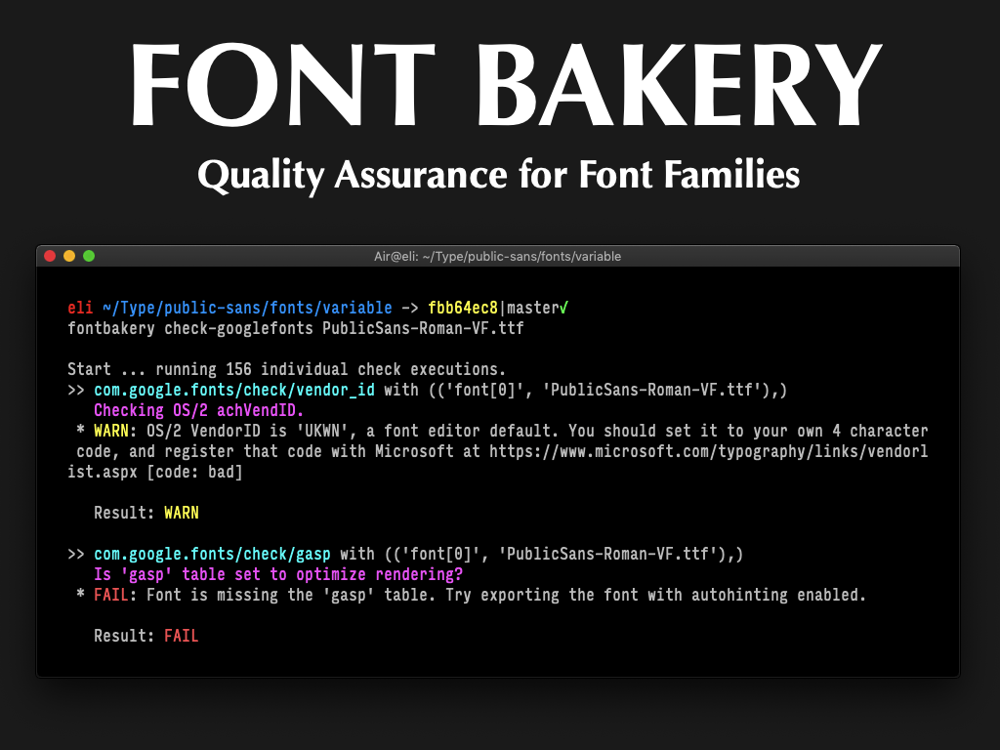
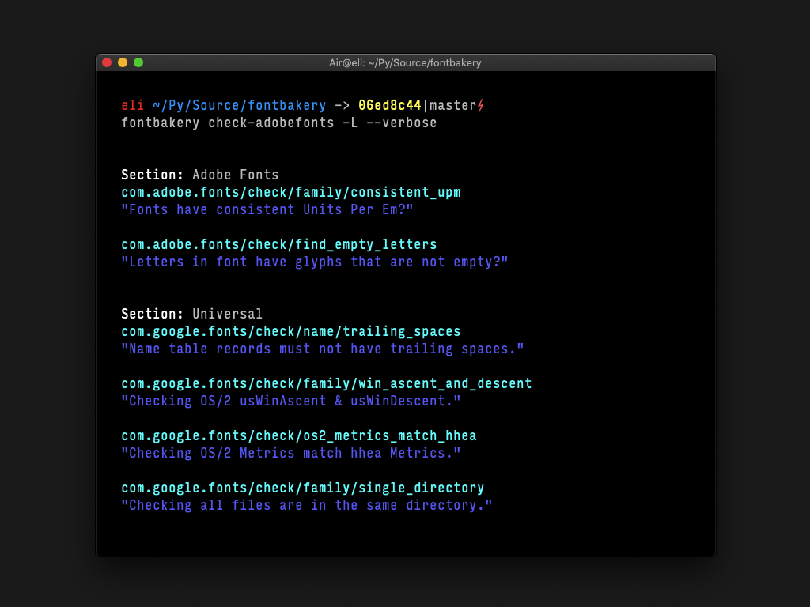
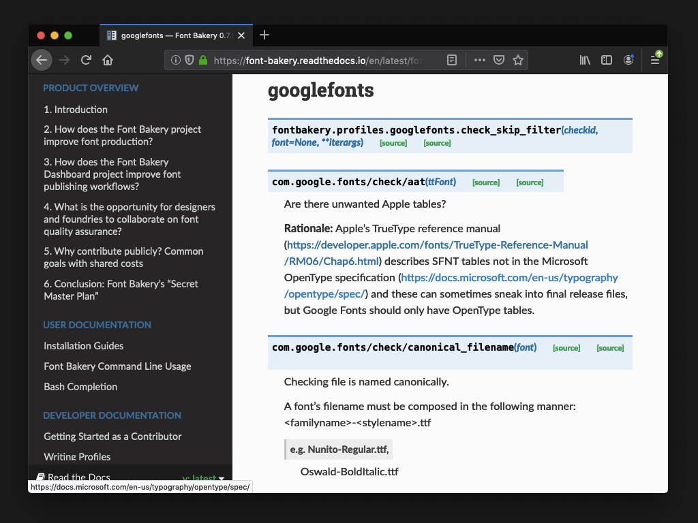
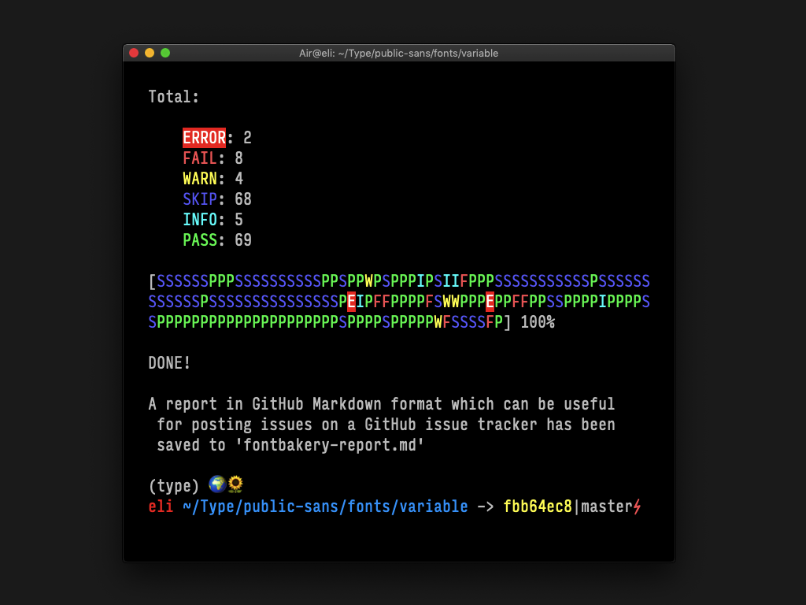

Font Bakery
Quality Assurance for Font Families

-- Slide 0 --

Font Bakery is an automated quality assurance tool that runs checks
on font families and generates a detailed report of any issues detected.

Our long term goal is to document all known failure modes for fonts,
including the rationale behind each kind of problem and how to address them.

This effort aims at enabling any interested person to become a font engineer.

-- Slide 1 --

Checks are gathered in profiles which include:
* checking routines directly mapping to the requirements of the OpenType specification;
* vendor-specific profiles like the Google Fonts and the Adobe Fonts ones;
* and the "universal" profile, which gathers the generaly accepted good practices among the type-design community.

-- Slide 2 --

Updates from this year:

* new checks for problems on Variable Fonts
* documentation of checks hosted on Read The Docs
* fairly active Gitter chat with a couple dozen users/developers
* automated markdown reports on GitHub pull requests

-- Slide 3 --

#CALL TO ACTION
* Github issues & pull request are always super welcome
* Please join our Gitter chat at https://gitter.im/fontbakery/Lobby

We plan to significantly improve the documentation of rationale behind
all known font problems and compile better instructions on how fo fix them.
This means we'd strongly encourage the participation of any person who's
interested in font production.
